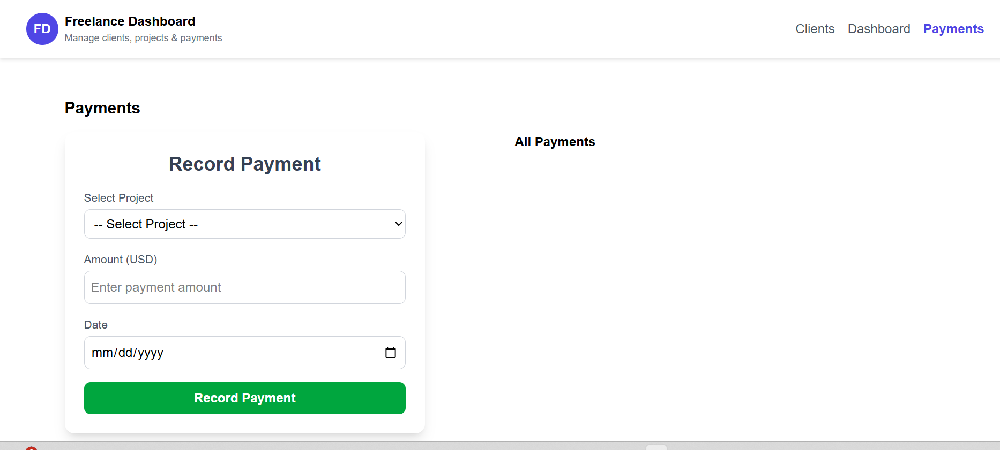

<!-- Freelance Dashboard -->

A responsive and modern dashboard application for managing clients, projects, and payments. Built with React, Vite, Tailwind CSS, and TypeScript, it features dark mode and global state management using the Context API.

 <!-- Features -->

Client Management: Add, view, and track client information (name, email, country).

Project Management: Create projects, manage budgets, and mark projects as paid.

Payment Tracking: Record and view payments associated with projects.

Dark Mode: Toggle between light and dark themes seamlessly.

Responsive Design: Works smoothly on mobile, tablet, and desktop.

Global State Management: Uses React Context API with useReducer for app-wide state.

<!-- Tech Stack -->

Frontend: React + TypeScript + Vite

Styling: Tailwind CSS

Routing: React Router DOM

State Management: React Context API + useReducer

<!-- Project Structure -->

The freelance-dashboard project is organized to separate components, pages, state management, and type definitions. Inside the src folder, the components directory contains reusable UI components like Navbar.tsx, ClientCard.tsx, and PaymentForm.tsx. The pages directory includes the main application pages: Home.tsx, Dashboard.tsx, Clients.tsx, and Payments.tsx. The state directory handles application state with context.tsx for managing clients, projects, and payments, and ThemeContext.tsx for dark/light theme support. TypeScript types are defined in the types directory inside index.ts. The main application files, App.tsx and main.tsx, sit directly in src. At the root of the project, there is index.html as the HTML template, package.json for dependencies and scripts, tailwind.config.js for Tailwind configuration, and vite.config.ts for Vite configuration.

⚡ Installation

Clone the repository:

git clone https://github.com/yourusername/freelance-dashboard.git
cd freelance-dashboard

Install dependencies:

npm install

Start the development server:

npm run dev

Open in browser:
https://freelance-dashboard-git-main-niyigena-marie-graces-projects.vercel.app/

<!-- Usage -->

Navigate between Home, Dashboard, Clients, and Payments via the navbar.

Add Clients: Use the Clients page to create and manage client profiles.

Manage Projects & Payments: Use the Dashboard and Payments pages to handle projects and record payments.

Dark Mode: Toggle the theme using the button in the navbar.

<!-- Available Scripts  -->
Command	Description
npm run dev	Start development server
npm run build	Build app for production
npm run preview	Preview the production build locally

/** Contributing

Create a branch: git checkout -b feature/YourFeature

Commit your changes: git commit -m "Add some feature"

Push to branch: git push origin feature/YourFeature

Open a Pull Request

 this is the image of payments

<!-- dashboard screenshoot  -->

<!--  Clients-->

The link deployed is : https://freelance-dashboard-git-main-niyigena-marie-graces-projects.vercel.app/